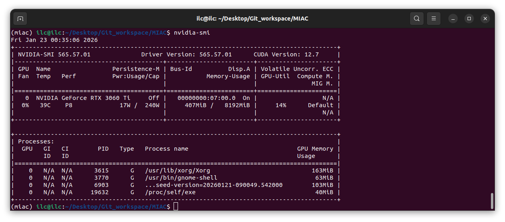
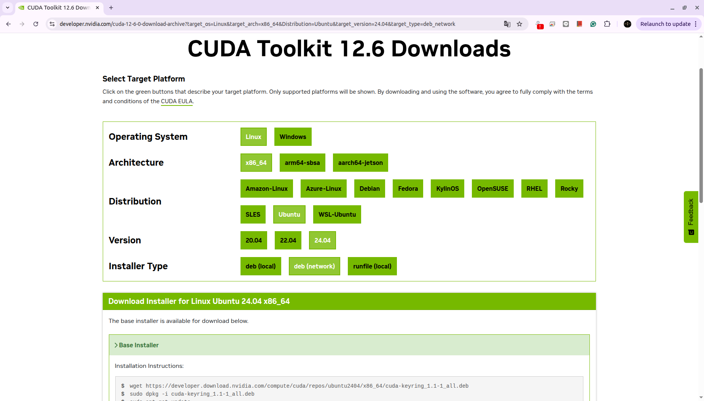
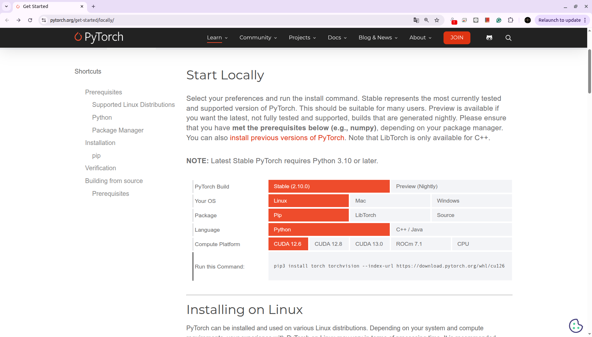

# MIAC
**Mirror - Interactive AI Creature - β**

---
**System Environment**
- OS: Ubuntu 24.04
- GPU: RTX3060-12G
- Python: 3.12
---

# 0.Setup Environment

- Use conda to manage the environment:

    `conda create --name miac python=3.12`

- Activate the virtual environment:

    `conda activate miac`

- Verify which `pip` is being used to ensure the environment is properly isolated:

    `whereis pip`

# 1.Setup Ollama

- **Install Ollama**

    `sudo apt update -y`
    `sudo apt install curl -y`
    `sudo curl -fsSL https://ollama.com/install.sh | sh`

- **Test model**

    - Multimodal: `ollama pull gemma3:4b` if result not well may consider change to `gemma3:12b` dynamically.
    - Multi-ligual Chat(casual): `ollama pull llama3.1:8b-instruct-q4_K_M`
    - Multi-ligual Chat(chinese more stable): `ollama pull qwen2.5:7b-instruct`

- **Ollama Model Size Overview**

    In general, larger models (more parameters) tend to provide better reasoning and output quality.
    However, model selection should always balance the following factors:
    - Hardware limitations (especially GPU VRAM)
    - Context length requirements
    - Expected use case and output quality

    Below is a comparison of commonly used Ollama models.

    ### 🔹 Multimodal Models (Text + Image)
    | Model        | Size  | Context Length | Input Type  |
    |-------------|-------|----------------|-------------|
    | gemma3:4b   | 3.3 GB | 128K           | Text, Image |
    | gemma3:12b  | 8.1 GB | 128K           | Text, Image |

    ---

    ### 🔹 Text-only Models (Large Context)

    | Model          | Size  | Context Length | Input Type |
    |---------------|-------|----------------|------------|
    | llama3.1:8b   | 4.9 GB | 128K           | Text       |
    | llama3.1:70b  | 43 GB  | 128K           | Text       |

    ---

    ### 🔹 Text-only Models (Balanced / Coding-friendly)

    | Model         | Size  | Context Length | Input Type |
    |---------------|-------|----------------|------------|
    | qwen2.5:7b   | 4.7 GB | 32K            | Text       |
    | qwen2.5:14b  | 9 GB   | 32K            | Text       |

- 

- **Model Training Preparation**
    - Use `nvidia-smi` to check GPU support's CUDA version on the right-top corner. It shows 12.7 below.
    

    ### CUDA Toolkit
    - Base on the version to search `CUDA toolkit xx.x download`, it will guide you to the download page.
    like CUDA toolkits 12.6 download page [here](https://developer.nvidia.com/cuda-12-6-0-download-archive?target_os=Linux&target_arch=x86_64&Distribution=Ubuntu&target_version=24.04&target_type=deb_network).
    
    After select your system environment then you can copy paste the command below to download the CUDA toolkits as you need.

    ### ‼️Activate the virtual environment first

    ### CuDNN (In virtual env)
    - Install CuDNN (pick one method to install)
        - conda: `conda install nvidia::cudnn cuda-version=12`
        - pip: `pip install nvidia-cudnn`

    ### Pytorch (In virtual env)
    - Go to `https://pytorch.org` check which version of Pytorch you're GPU can support. Currently it would be Pytorch with CUDA 12.6 support.
    
    Use the command that provide to install the Pytorch.
